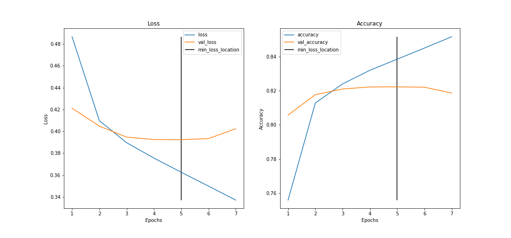
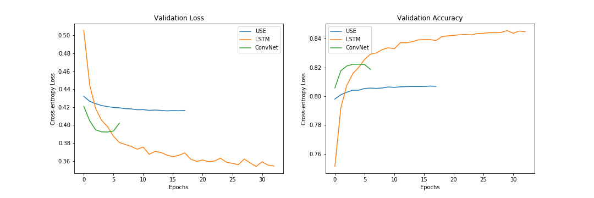
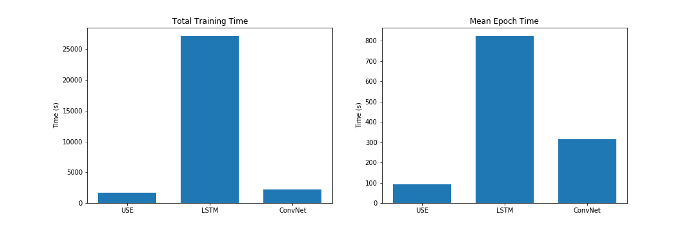

# Character Convolutions for Text Classification

This is an implmenetation of "Character-level Convolutional Networks for Text Classification" in TensorFlow.

Paper: [https://arxiv.org/pdf/1509.01626.pdf](https://arxiv.org/pdf/1509.01626.pdf)

## Architecture

The architecture of the model is described in section 2.3 of the paper.

### Convolutions with Pooling

There are 6 convolutions with 3 pooling operations.

|  Layer  | ConV Layer Name | Large Feature | Small Feature | Kernel | Pool | Pool Layer Name |
|:-------:|:---------------:|:-------------:|:-------------:|:------:|:----:|:---------------:|
| 1             |  conv_1   |   1024        |   256         | 7      |  3   | pooling_1  |
| 2             | conv_2    |   1024        |   256         | 7      |  3   | pooling_2  |
| 3             |  conv_3   |   1024        |   256         | 3      |  N/A | N/A  |
| 4             | conv_4    |   1024        |   256         | 3      |  N/A | N/A  |
| 5             |  conv_5   |   1024        |   256         | 3      |  N/A | N/A  |
| 6             | conv_6    |   1024        |   256         | 3      |  3   | pooling_3  |

### Dense and Output

|  Layer  | Name | Large Feature | Small Feature |
|:-------:|:---------------:|:-------------:|:-------------:|
| 7       |  dense_out_1   |   2048        |   1024         |
| 8       | dense_out_2    |   2048        |   1024         |
| 9       |  output        |   Number of Classes   |   Number of Classes |

Dropout of probability of 0.5 is included between each fully connected layer.

## Advantages and Disadvantages

### Advantages

* Much faster to train than recurrent-based networks
* The embedding matrix for characters is small compared to the embedding matrix needed for word-level representations.
* Handles out-of-vocabulary words (misspellings, new slang, etc.)

### Disadvantages

* No notion of word level semantics

## Benchmark

This model was trained on twitter messages (from 2012) annotated with sentiment (positive or negative). 
See ["Twitter Sentiment Classification using Distant Supervision"](https://www-cs.stanford.edu/people/alecmgo/papers/TwitterDistantSupervision09.pdf) for more information on the dataset.

This character-level convolutional model performs on par with the more traditional methods shown in the paper.
The ConvNet model performance is shown below.

## Comparison vs LSTM, Universal Sentence Encoder

This model was compared with the Universal Sentence Encoder (USE) and a character-level bidirectional LSTM.
As shown in the validation performance plots below,
the LSTM provides the best accuracy followed by the ConvNet model and the USE model 

However, in terms of cost, we can see that models rank in the opposite order (no free lunch).
The bidirectional LSTM provided the best validation accuracy,
but at a much greater cost.
The ConvNet model provides a good middle ground between the three models with reasonably good accuracy at relatively training cost.

## Notebook 

A notebook walking through this comparison is located 
[here](./character-convolution-tutorial.ipynb)

